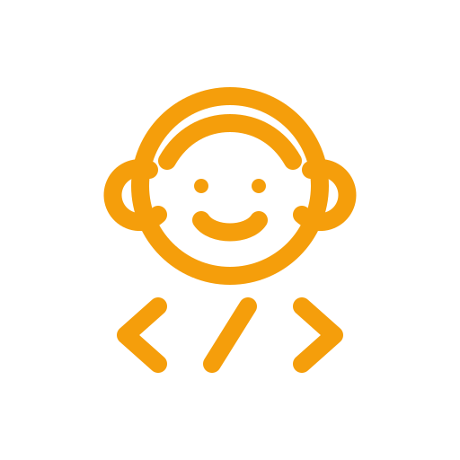

<div align="center">



# Wukong Code

**コーディングエージェントのための完全なソフトウェア開発方法論**<br>
設計を先に · テスト駆動開発 · 主張より検証

[](LICENSE)
[](https://github.com/wukongnotnull/wukong-code/tags)
[](https://github.com/wukongnotnull/wukong-code)
[](https://github.com/wukongnotnull/wukong-code/stargazers)

</div>

**言語：** [English](README.md) · [简体中文](README.zh-CN.md) · [繁體中文](README.zh-TW.md) · [日本語](README.ja.md) · [한국어](README.ko.md)

> Wukong Code は、組み合わせ可能なスキルと、それらを適切なタイミングで自動起動させる初期指示をコーディングエージェントに提供します。ブレインストーミングと計画から TDD、レビュー、検証までを一貫して支えます。

---

**クイックナビ**<br>
[Wukong Code を選ぶ理由](#wukong-code-を選ぶ理由) · [仕組み](#仕組み) · [インストール](#対応エージェントとインストール) · [基本ワークフロー](#基本ワークフロー) · [スキル](#収録内容) · [言語ガイダンス](#言語ガイダンス) · [テスト](#テスト) · [FAQ](#faq) · [コントリビューション](#コントリビューション) · [ライセンス](#ライセンス)

---

## Wukong Code を選ぶ理由

| 機能 | 得られるもの |
| --- | --- |
| **実装より先に設計** | エージェントが目的を明確にし、選択肢を比較し、承認を得てから実装します |
| **実行可能な計画** | 承認済みの設計を、対象ファイルと検証手順が明確な小さなタスクに分解します |
| **本物の TDD** | 実装後にテストを追加するのではなく、RED–GREEN–REFACTOR を徹底します |
| **体系的なデバッグ** | 修正案を出す前に根本原因を調査します |
| **工程内レビュー** | 進行中に仕様適合性とコード品質を継続して確認します |
| **主張より検証** | 推測ではなく、最新の検証結果をもって完了とします |
| **自動起動** | タスクの文脈に応じてスキルが起動し、毎回特別なプロンプトを入力する必要はありません |

コードを速く生成するだけでなく、再現可能なエンジニアリングプロセスをエージェントに守らせたい開発者向けです。

---

## 仕組み

Wukong Code はエージェントのセッション開始時から動作します。リクエストを適切なソフトウェア開発または Product Design ワークフローへ振り分け、そのタスクに必要な専門スキルだけを読み込みます。

### ソフトウェア開発

開発や振る舞いの変更を検知すると、すぐにコードを書くのではなく、まず本当に達成したいことを明確にします。

設計が承認されると、具体的な実装計画を作成し、正しい Red/Green TDD を実践します。必要に応じて独立したタスクを委任し、成果をレビューし、変更全体を検証してから完了を宣言します。

```text
あなたのアイデア
   ↓
ブレインストーミング → 承認済み設計 → 実装計画
   ↓
RED → GREEN → REFACTOR → レビュー → 検証
   ↓
マージ / PR 作成 / ブランチを保持
```

### Product Design

Product Design は、プロダクトのアイデアと動くソフトウェアの間をつなぎます。保存済みのプロダクト情報がある場合は、ブランド素材、デザインシステム、スクリーンショット、コンポーネント、使用ツールの設定を根拠として利用し、目的に合った経路を選びます。

```text
リサーチまたは監査
プロダクト / フロー → 現在の証拠を取得 → UX・ビジュアル・アクセシビリティの提案

新しい方向を探索
デザインブリーフ → 3 つのビジュアル案 → 選択 → レスポンシブなプロトタイプ

複製または実装
公開 URL または選択済みビジュアル → フロントエンド実装 → Design QA → プレビュー / 共有
```

リサーチと監査は現在取得した証拠に基づき、ソースコードを変更しません。新しいデザインは、ビジュアル方向を選択してから実装へ進みます。プロトタイプは、レンダリング結果をビジュアルソースと比較し、Design QA に合格するまで引き渡されません。

スキルは自動的に起動します。普段どおりエージェントと対話するだけで、ソフトウェア開発と Product Design の各プロセスがセッション内で動作し、実際に利用できるブラウザ、画像生成、ローカルビルド、共有機能に合わせて実行方法を調整します。

---

## 対応エージェントとインストール

インストール方法はエージェントごとに異なります。複数を使う場合は、それぞれに Wukong Code をインストールしてください。

現在のリリース：**[v6.3.0](https://github.com/wukongnotnull/wukong-code/releases/tag/v6.3.0)**。このリリースで Gemini CLI のサポートは終了し、現在の対応一覧には含まれません。

**対応：** [Antigravity](#antigravity) · [Claude Code](#claude-code) · [Codex App](#codex-app) · [Codex CLI](#codex-cli) · [Cursor](#cursor) · [Factory Droid](#factory-droid) · [GitHub Copilot CLI](#github-copilot-cli) · [Kimi Code](#kimi-code) · [OpenCode](#opencode) · [Pi](#pi)

### Antigravity

このリポジトリからインストールします。

```bash
agy plugin install https://github.com/wukongnotnull/wukong-code
```

Antigravity はセッション開始フックを実行するため、最初のメッセージから Wukong Code が有効です。更新するには同じコマンドを再実行してください。

### Claude Code

このリポジトリからインストールします。

```bash
/plugin marketplace add wukongnotnull/wukong-code
/plugin install wukong-code@wukong-code
```

### Codex App

Wukong Code は [Codex 公式プラグインマーケットプレイス](https://github.com/openai/plugins)から利用できます。

1. Codex サイドバーの **Plugins** をクリックします。
2. Coding セクションで **Wukong Code** を探します。
3. `+` をクリックし、案内に従います。

### Codex CLI

プラグイン画面を開きます。

```text
/plugins
```

`wukong-code` を検索し、**Install Plugin** を選択します。

### Cursor

Cursor Agent のチャットで次を実行します。

```text
/add-plugin wukong-code
```

プラグインマーケットプレイスで `wukong-code` を検索することもできます。

### Factory Droid

```bash
droid plugin marketplace add https://github.com/wukongnotnull/wukong-code
droid plugin install wukong-code@wukong-code
```

### GitHub Copilot CLI

```bash
copilot plugin marketplace add wukongnotnull/wukong-code
copilot plugin install wukong-code@wukong-code
```

### Kimi Code

`/plugins` を開き、**Marketplace → Wukong Code** からインストールします。リポジトリから直接インストールすることもできます。

```text
/plugins install https://github.com/wukongnotnull/wukong-code
```

詳細は [Kimi Code インストールガイド](docs/README.kimi.md)を参照してください。

### OpenCode

OpenCode に次のように伝えます。

```text
Fetch and follow instructions from https://raw.githubusercontent.com/wukongnotnull/wukong-code/refs/heads/main/.opencode/INSTALL.md
```

詳細は [OpenCode インストールガイド](docs/README.opencode.md)を参照してください。

### Pi

Pi パッケージとしてインストールします。

```bash
pi install git:github.com/wukongnotnull/wukong-code
```

ローカル開発では次を実行します。

```bash
pi -e /path/to/wukong-code
```

Pi パッケージはスキルを読み込み、起動時とコンテキスト圧縮後に `using-wukong-code` ブートストラップを注入します。Pi はスキルをネイティブサポートし、サブエージェントとタスクリストのツールは任意の補助パッケージです。

---

## 基本ワークフロー

### ソフトウェア開発ワークフロー

1. **using-wukong-code** — 何かを実行する前にタスクを確認し、適用可能な最小のワークフローを選択します。
2. **brainstorming**、**systematic-debugging**、または直接処理 — 新機能は設計から、原因不明のバグは根本原因の調査から始め、明確な機械的変更は直接処理します。
3. **writing-plans** — 承認済みの複数ステップ設計を、正確なファイルパスと検証手順を持つ小さなタスクに分解します。
4. **using-git-worktrees** — 実行に分離が必要な場合、独立した作業環境を作り、クリーンなテストベースラインを確認します。
5. **subagent-driven-development** または **executing-plans** — タスク単位のレビューまたは人間のチェックポイントを交えて計画を実行し、TDD が適用される場合は RED–GREEN–REFACTOR に従います。
6. **verification-before-completion** とコードレビュー — 完了を主張する前に最新の証拠を取得し、結果全体を確認します。
7. **finishing-a-development-branch** — 既に指定された統合方針に従い、未指定ならマージ、PR、保持、破棄の選択肢を提示します。

**エージェントはすべてのタスクの前に関連スキルを確認します。これらは推奨ではなく、必須のワークフローです。**

### Product Design ワークフロー

1. **product-design** — 目的を識別し、適切な Product Design 専門スキルへリクエストを振り分けます。
2. **product-design-user-context** — 現在のタスクの根拠になる場合、保存済みのブランド素材、デザインシステム、スクリーンショット、参考資料、設定を読み込みます。
3. **product-design-context** — ビジュアル探索や実装の前に、デザイン対象、対象ユーザー、期待する成果を明確にします。
4. **product-design-research**、**product-design-audit**、または **product-design-ideate** — 現在のユーザー課題を調査し、取得したプロダクトの証拠を監査し、または選択用の 3 つのビジュアル方向を生成します。
5. **product-design-url-to-code** または **product-design-image-to-code** — 公開 URL を忠実に再現するか、選択したビジュアルをレスポンシブなフロントエンドとして実装します。
6. **product-design-design-qa** — レンダリングしたプロトタイプとビジュアルソースを比較し、合格するまで引き渡しを止めます。
7. **product-design-share** — ユーザーが公開または共有を求めた場合、実行可能なプロトタイプを公開して共有リンクを返します。

**これらのスキルが毎回ひとつの固定順序ですべて実行されるわけではありません。Product Design は、リサーチ、監査、アイデア探索、複製、実装、QA、共有の目的に応じて、適用可能な最短経路を選びます。**

---

## 収録内容

バージョン `6.3.0` には **26 個のトップレベルスキル**（汎用開発スキル 16 個、Product Design スキル 10 個）が収録されています。

| 分野 | スキルとガイダンス |
| --- | --- |
| **テスト** | `test-driven-development`、テストのアンチパターン |
| **デバッグ** | `systematic-debugging`、根本原因の追跡、多層防御、条件ベースの待機 |
| **検証** | `verification-before-completion` |
| **計画** | `brainstorming`、`grilling`、`writing-plans`、`executing-plans` |
| **協業** | `dispatching-parallel-agents`、`subagent-driven-development`、`requesting-code-review`、`receiving-code-review` |
| **ワークスペース** | `using-git-worktrees`、`finishing-a-development-branch` |
| **言語別実装** | 実験的でエビデンスベースの `language-guidance` パック |
| **メタ** | `writing-skills`、`using-wukong-code` |

### Product Design

バージョン `6.3.0` には、次の 10 個の Product Design スキルが含まれます。

| スキル | 役割 |
| --- | --- |
| `product-design` | Product Design の総合入口として、目的に合う専門ワークフローへ振り分けます |
| `product-design-user-context` | ブランド素材、デザインシステム、スクリーンショット、参考資料、設定を保存または読み込みます |
| `product-design-context` | デザイン対象、対象ユーザー、期待する成果を明確にします |
| `product-design-research` | 最新の情報源からユーザーの課題とプロダクト機会を調査します |
| `product-design-audit` | 現在取得した証拠を基に、プロダクトフローの UX、ビジュアル、アクセシビリティを監査します |
| `product-design-ideate` | 具体的な題材に根ざし、意図的な視覚選択とアンチテンプレート批評を備えた 3 つの独自方向を、[Anthropic Frontend Design](https://github.com/anthropics/skills/tree/main/skills/frontend-design) を翻案した指針で生成します |
| `product-design-url-to-code` | 公開 URL を忠実に再現した、実行可能なローカルフロントエンドプロトタイプを作成します |
| `product-design-image-to-code` | 選択したビジュアルソースをレスポンシブで操作可能なフロントエンドとして実装します |
| `product-design-design-qa` | ビジュアルソースとレンダリング結果を比較し、引き渡しの合否を判定します |
| `product-design-share` | 要求されたときに実行可能なプロトタイプを公開し、共有リンクを返します |

これらは Product Design `0.1.52` から取り込まれています。MIT ライセンスの出所は [`product-design.lock.json`](product-design.lock.json) と [`THIRD_PARTY_NOTICES.md`](THIRD_PARTY_NOTICES.md) に記録されています。

取り込み内容の検証：

```bash
node scripts/check-product-design-import.mjs
```

---

## 言語ガイダンス

Wukong Code の方法論は言語に依存しません。リポジトリの根拠から対応言語と作業フェーズを特定できた場合のみ、エージェントは必要な実装ガイダンスを読み込みます。言語パックがツールをインストールしたり、リポジトリのコマンドを上書きしたりすることはありません。

| 言語 | ステータス | 実装 | テスト | デバッグ | レビュー | 検証 | エビデンス |
| --- | --- | --- | --- | --- | --- | --- | --- |
| Go | 実験的 | ✓ | ✓ | ✓ | ✓ | ✓ | [評価レポート](docs/wukong-code/evals/2026-07-22-go-language-guidance.md) |
| Java | 実験的 | ✓ | ✓ | ✓ | ✓ | ✓ | [評価レポート](docs/wukong-code/evals/2026-08-02-java-language-guidance.md) |
| TypeScript | 計画中 | — | — | — | — | — | — |
| Swift | 実験的 | ✓ | ✓ | ✓ | ✓ | ✓ | [評価レポート](docs/wukong-code/evals/2026-07-29-swift-language-guidance.md) |
| Rust | 実験的 | ✓ | ✓ | ✓ | ✓ | ✓ | [評価レポート](docs/wukong-code/evals/2026-07-29-rust-language-guidance.md) |

**実験的**とは、初期の振る舞い評価は完了しているものの、実プロジェクトでの根拠を蓄積中であることを意味します。フレームワーク、クラウドサービス、データベース、チーム固有のガイダンスはコアの対象外です。

---

## テスト

決定論的なコアチェックを実行します。

```bash
npm test
```

コアに加えて brainstorm-server と Antigravity のチェックを実行します。

```bash
npm run test:extended
```

ホスト CLI、認証情報、実際の LLM セッションを必要とするテストは手動実行です。プラグインテストの入口と、独立した [wukong-code-evals](https://github.com/wukongnotnull/wukong-code-evals) の振る舞い評価手順は [`docs/testing.md`](docs/testing.md) を参照してください。

---

## 方針

| 原則 | 意味 |
| --- | --- |
| **テスト駆動開発** | 失敗するテストを最初に書く |
| **場当たり的でなく体系的** | 推測ではなく再現可能なプロセスに従う |
| **複雑さを減らす** | 最小で明確な解決策を優先する |
| **主張よりエビデンス** | 成功を宣言する前に検証する |

---

## FAQ

**スキルを手動で呼び出す必要がありますか？**<br>
ありません。正しく統合されたエージェントはセッション開始時にブートストラップを読み込み、タスクの文脈から関連スキルを選びます。

**複数のコーディングエージェントにインストールできますか？**<br>
はい。プラグインシステムは互いに独立しているため、それぞれにインストールしてください。

**更新方法は？**<br>
各エージェントが提供する更新手順を使用してください。リポジトリからインストールした場合は、通常、同じインストールコマンドを再実行して更新できます。

**Wukong Code はプロジェクトの依存関係をインストールしますか？**<br>
いいえ。コアはゼロ依存で、言語パックもツールをインストールしたり、リポジトリが定義したコマンドを置き換えたりしません。

**振る舞い評価はどこにありますか？**<br>
スキルの振る舞い評価は [wukong-code-evals](https://github.com/wukongnotnull/wukong-code-evals) にあり、ローカルでは `evals/` にクローンします。プラグイン基盤のテストは `tests/` にあります。

---

## コントリビューション

コントリビューションは、実際に経験した具体的な問題を解決する必要があります。開始前に [`.github/PULL_REQUEST_TEMPLATE.md`](.github/PULL_REQUEST_TEMPLATE.md) とリポジトリのコントリビューター向け指示を読んでください。

ドメイン固有または外部由来のスキルも、対象者が明確で、対応エージェント全体で安全に保守できる場合はコアレビューの対象になります。コントリビューターは、出所、ライセンス、依存関係への影響、テストまたは評価、保守・更新方針を開示する必要があります。エージェント対応の例外が別途明記されていない限り、コアはゼロ依存を維持します。

1. 関連するオープン・クローズ済み PR を検索します。
2. リポジトリをフォークして `dev` ブランチに切り替えます。
3. 1 つの明確な問題につき 1 つのブランチを作ります。
4. スキル変更では `writing-skills` と振る舞い評価を使用します。
5. 少なくとも 1 つのエージェントでテストし、エージェント環境を完全に開示します。
6. PR を作成する前に、人間のレビュアーへ完全な diff を提示します。

プロジェクト固有、ツール固有、または個人向けの狭い統合は通常、独立したプラグインとして公開します。完全な手順は [`skills/writing-skills/SKILL.md`](skills/writing-skills/SKILL.md) と [`docs/testing.md`](docs/testing.md) を参照してください。

---

## コミュニティ

- [GitHub Issues](https://github.com/wukongnotnull/wukong-code/issues)
- [ソースリポジトリ](https://github.com/wukongnotnull/wukong-code)

---

## ライセンス

Wukong Code は [MIT License](LICENSE) のもとで公開されています。第三者に関する告知は [`THIRD_PARTY_NOTICES.md`](THIRD_PARTY_NOTICES.md) に記録されています。

<div align="center">

MIT License · [Wukong Code](https://github.com/wukongnotnull/wukong-code)

</div>
