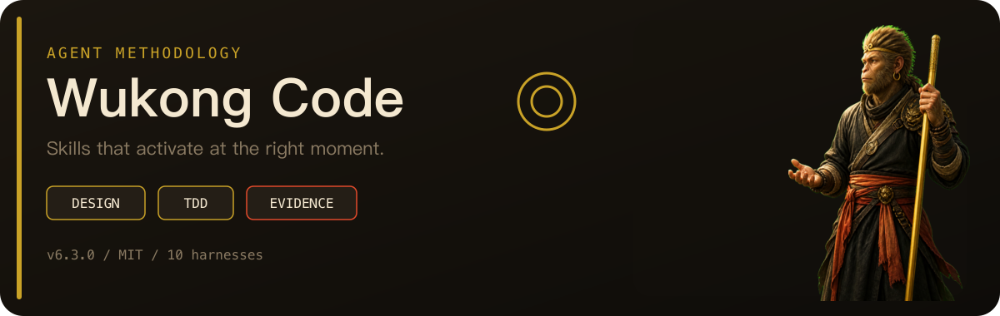
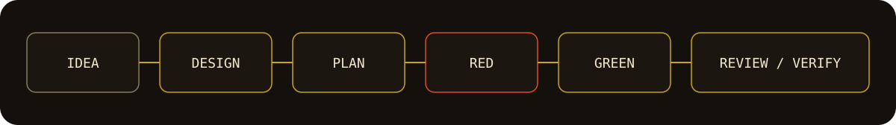

# Wukong Code

<p align="center">
  
</p>

**面向编程智能体的完整软件开发方法论**

先设计 · 测试驱动开发 · 先验证再下结论

[许可证：MIT](LICENSE)
[版本](https://github.com/wukongnotnull/wukong-code/tags)
[插件](https://github.com/wukongnotnull/wukong-code)
[Stars](https://github.com/wukongnotnull/wukong-code/stargazers)

**多语言：** [English](README.md) · [简体中文](README.zh-CN.md) · [繁體中文](README.zh-TW.md) · [日本語](README.ja.md) · [한국어](README.ko.md)

> Wukong Code 为你的编程智能体提供一套可组合的技能，以及确保技能在正确时机自动触发的启动指令——覆盖需求探索、设计规划、TDD、评审与最终验证。

<p align="center">
  
</p>

---

**快捷导航**

[为什么选择 Wukong Code](#为什么选择-wukong-code) · [工作原理](#工作原理) · [安装](#支持的智能体与安装方法) · [基础工作流](#基础工作流) · [技能库](#包含内容) · [语言指导](#语言指导) · [常见问题](#常见问题) · [参与贡献](#参与贡献) · [许可证](#许可证)

---

## 为什么选择 Wukong Code


| 能力          | 你能得到什么                               |
| ----------- | ------------------------------------ |
| **先设计再写代码** | 智能体先澄清目标、比较方案并获得确认，然后才开始实现           |
| **可执行的计划**  | 将已确认的设计拆成带有具体文件和验证步骤的小任务             |
| **真正的 TDD** | 强制执行 RED–GREEN–REFACTOR，而不是写完代码后再补测试 |
| **系统化调试**   | 提出修复方案前先调查根因                         |
| **全程评审**    | 实施过程中持续检查需求符合度和代码质量                  |
| **先验证再下结论** | 必须取得最新验证结果，不能凭假设宣布完成                 |
| **自动触发**    | 技能根据任务上下文自动启用，无需每次输入特殊提示词            |


适合希望编程智能体遵循可重复工程流程，而不只是快速生成代码的开发者。

---

## 工作原理

Wukong Code 从智能体会话启动时开始工作。它会先将请求路由到对应的软件开发或 Product Design 工作流，再只加载当前任务真正需要的专用技能。

### 软件开发

当智能体识别到构建或行为变更任务时，它不会立即写代码，而是先弄清你真正想实现的目标。

设计获得确认后，智能体会创建具体实施计划，遵循真正的红/绿 TDD，在合适时委派独立任务，评审结果，并在宣布完成前验证整个变更。

```text
你的想法
   ↓
需求探索 → 已确认的设计 → 实施计划
   ↓
RED → GREEN → REFACTOR → 评审 → 验证
   ↓
合并 / 创建 PR / 保留分支
```

### Product Design

Product Design 连接产品想法与可运行的软件。存在已保存的产品资料时，它会使用品牌素材、设计系统、截图、组件和偏好工具作为设计依据，再根据你的目标选择相应路径：

```text
研究或审计
产品 / 流程 → 采集当前证据 → UX、视觉与无障碍建议

探索新方向
设计简报 → 3 个视觉方案 → 你来选择 → 响应式原型

复刻或实现
线上 URL 或选定视觉稿 → 前端实现 → Design QA → 预览 / 分享
```

研究和审计以当前采集的证据为准，不修改源代码。新设计必须先选定视觉方向，才能进入实现。原型交付前必须将渲染结果与视觉来源进行比较，并通过 Design QA。

技能会自动触发，所以你只需像平时一样与编程智能体协作。软件开发和 Product Design 流程都已内置在会话中，并会根据当前实际可用的浏览器、图像生成、本地构建和分享能力调整执行方式。

---

## 支持的智能体与安装方法

不同智能体的安装方式不同。如果你同时使用多个智能体，需要分别安装 Wukong Code。

**支持：** [Antigravity](#antigravity) · [Claude Code](#claude-code) · [Codex App](#codex-app) · [Codex CLI](#codex-cli) · [Cursor](#cursor) · [Factory Droid](#factory-droid) · [GitHub Copilot CLI](#github-copilot-cli) · [Kimi Code](#kimi-code) · [OpenCode](#opencode) · [Pi](#pi)

### Antigravity

从本仓库安装插件：

```bash
agy plugin install https://github.com/wukongnotnull/wukong-code
```

Antigravity 会运行会话启动钩子，因此 Wukong Code 从第一条消息起就会生效。更新时重复执行同一命令。

### Claude Code

从本仓库安装：

```bash
/plugin marketplace add wukongnotnull/wukong-code
/plugin install wukong-code@wukong-code
```

### Codex App

Wukong Code 尚未上架 Codex 官方插件市场，请直接通过本仓库链接安装：

1. 点击 Codex 侧边栏中的 **Plugins**。
2. 选择通过仓库 URL 安装插件的选项。
3. 输入 `https://github.com/wukongnotnull/wukong-code`，按提示完成安装。

### Codex CLI

添加本仓库作为插件市场来源，然后安装 Wukong Code：

```bash
/plugin marketplace add wukongnotnull/wukong-code
/plugin install wukong-code@wukong-code
```

### Cursor

在 Cursor Agent 对话中输入：

```text
/add-plugin wukong-code
```

也可以在插件市场搜索 `wukong-code`。

### Factory Droid

```bash
droid plugin marketplace add https://github.com/wukongnotnull/wukong-code
droid plugin install wukong-code@wukong-code
```

### GitHub Copilot CLI

```bash
copilot plugin marketplace add wukongnotnull/wukong-code
copilot plugin install wukong-code@wukong-code
```

### Kimi Code

打开 `/plugins`，进入 **Marketplace → Wukong Code** 并安装。也可以从本仓库直接安装：

```text
/plugins install https://github.com/wukongnotnull/wukong-code
```

详细说明见 [Kimi Code 安装指南](docs/README.kimi.md)。

### OpenCode

告诉 OpenCode：

```text
Fetch and follow instructions from https://raw.githubusercontent.com/wukongnotnull/wukong-code/refs/heads/main/.opencode/INSTALL.md
```

详细说明见 [OpenCode 安装指南](docs/README.opencode.md)。

### Pi

作为 Pi 软件包安装：

```bash
pi install git:github.com/wukongnotnull/wukong-code
```

本地开发时：

```bash
pi -e /path/to/wukong-code
```

Pi 软件包会加载技能，并在会话启动和上下文压缩后注入 `using-wukong-code` 引导指令。Pi 原生支持技能；子智能体和任务列表工具仍是可选的配套软件包。

---

## 基础工作流

### 软件开发工作流

1. **using-wukong-code** — 在采取任何行动前检查任务，并选择最小且适用的工作流。
2. **brainstorming**、**systematic-debugging** 或直接处理 — 新功能先设计，根因不明的错误先调查，明确的机械修改直接执行。
3. **writing-plans** — 将已确认的多步骤设计拆成带有具体文件路径和验证步骤的小任务。
4. **using-git-worktrees** — 执行需要隔离时创建独立工作区，并验证干净的测试基线。
5. **subagent-driven-development** 或 **executing-plans** — 通过任务级评审或人工检查点执行计划；适用 TDD 时遵循 RED–GREEN–REFACTOR。
6. **verification-before-completion** 与代码评审 — 宣布完成前取得最新证据，并检查完整结果。
7. **finishing-a-development-branch** — 遵循已有的集成意图；如果尚未决定，则提供合并、PR、保留和丢弃选项。

**智能体会在每个任务开始前检查相关技能。这些工作流是必须遵循的要求，不是建议。**

### Product Design 工作流

1. **product-design** — 识别目标，并将请求路由到对应的 Product Design 专用技能。
2. **product-design-user-context** — 在资料能为当前任务提供依据时，加载已保存的品牌素材、设计系统、截图、参考资料和偏好。
3. **product-design-context** — 在视觉探索或实现前，明确设计目标、目标用户和预期结果。
4. **product-design-research**、**product-design-audit** 或 **product-design-ideate** — 研究当前用户痛点、审计采集到的产品证据，或生成三个视觉方向供用户选择。
5. **product-design-url-to-code** 或 **product-design-image-to-code** — 忠实复刻线上 URL，或将选定视觉稿实现为响应式前端。
6. **product-design-design-qa** — 对比渲染原型与视觉来源；比较通过前阻止交付。
7. **product-design-share** — 用户要求部署或分享时，发布可运行原型并返回分享链接。

**这些技能不会在每次请求中按固定顺序全部运行。Product Design 会根据研究、审计、创意、复刻、实现、QA 或分享目标，选择最短的适用路径。**

---

## 包含内容

**26 个顶层技能**：16 个通用开发技能和 10 个 Product Design 技能。


| 领域       | 技能与指导                                                                                                        |
| -------- | ------------------------------------------------------------------------------------------------------------ |
| **测试**   | `test-driven-development`、测试反模式                                                                              |
| **调试**   | `systematic-debugging`、根因追踪、纵深防御、基于条件的等待                                                                     |
| **验证**   | `verification-before-completion`                                                                             |
| **规划**   | `brainstorming`、`grilling`、`writing-plans`、`executing-plans`                                                 |
| **协作**   | `dispatching-parallel-agents`、`subagent-driven-development`、`requesting-code-review`、`receiving-code-review` |
| **工作区**  | `using-git-worktrees`、`finishing-a-development-branch`                                                       |
| **语言实现** | 基于证据的实验性 `language-guidance` 指导包                                                                             |
| **元技能**  | `writing-skills`、`using-wukong-code`                                                                         |


### Product Design

包含以下 10 个 Product Design 技能：


| 技能                             | 作用                                                                                                                                           |
| ------------------------------ | -------------------------------------------------------------------------------------------------------------------------------------------- |
| `product-design`               | Product Design 总入口，根据目标路由到对应的专用工作流                                                                                                           |
| `product-design-user-context`  | 保存或加载品牌素材、设计系统、截图、参考资料和偏好                                                                                                                    |
| `product-design-context`       | 明确设计目标、目标用户和预期结果                                                                                                                             |
| `product-design-research`      | 基于最新来源研究用户痛点与产品机会                                                                                                                            |
| `product-design-audit`         | 根据当前采集的证据审计产品流程中的 UX、视觉与无障碍问题                                                                                                                |
| `product-design-ideate`        | 生成三个立足具体主题、视觉选择明确且经过反模板批评的原创方向 |
| `product-design-url-to-code`   | 将线上 URL 忠实复刻为可运行的本地前端原型                                                                                                                      |
| `product-design-image-to-code` | 将选定视觉稿实现为响应式交互前端                                                                                                                             |
| `product-design-design-qa`     | 对比视觉来源与渲染结果，并作为原型交付门槛                                                                                                                        |
| `product-design-share`         | 用户要求时发布可运行原型并返回分享链接                                                                                                                          |

---

## 语言指导

Wukong Code 的方法论保持语言无关。当仓库证据能够确定受支持的语言和工作阶段时，智能体只加载当前所需的实现指导。指导包不会安装工具，也不会覆盖仓库定义的命令。


| 语言         | 状态  | 实现  | 测试  | 调试  | 评审  | 验证  | 证据                                                                   |
| ---------- | --- | --- | --- | --- | --- | --- | -------------------------------------------------------------------- |
| Go         | 实验性 | ✓   | ✓   | ✓   | ✓   | ✓   | [评估报告](docs/wukong-code/evals/2026-07-22-go-language-guidance.md)    |
| Java       | 实验性 | ✓   | ✓   | ✓   | ✓   | ✓   | [评估报告](docs/wukong-code/evals/2026-08-02-java-language-guidance.md)  |
| TypeScript | 实验性 | ✓   | ✓   | ✓   | ✓   | ✓   | 评估仍在积累                                                         |
| JavaScript | 实验性 | ✓   | ✓   | ✓   | ✓   | ✓   | 评估仍在积累                                                         |
| Swift      | 实验性 | ✓   | ✓   | ✓   | ✓   | ✓   | [评估报告](docs/wukong-code/evals/2026-07-29-swift-language-guidance.md) |
| Rust       | 实验性 | ✓   | ✓   | ✓   | ✓   | ✓   | [评估报告](docs/wukong-code/evals/2026-07-29-rust-language-guidance.md)  |


**实验性**表示已完成初步行为评估，但仍在积累真实项目证据。框架、云服务、数据库和团队专用指导不属于核心范围。

---

## 理念


| 原则            | 含义             |
| ------------- | -------------- |
| **测试驱动开发**    | 永远先写失败测试       |
| **系统化优于临时发挥** | 遵循可重复流程，而不是猜测  |
| **降低复杂度**     | 优先选择最小且清晰的解决方案 |
| **证据优于声明**    | 宣布成功前先验证       |


---

## 常见问题

**需要手动调用技能吗？**

不需要。正确集成的智能体会在会话启动时加载引导指令，再根据任务上下文选择相关技能。

**可以在多个编程智能体中安装吗？**

可以。不同智能体的插件系统彼此独立，需要分别安装。

**如何更新？**

使用对应智能体提供的更新流程。通过仓库安装时，通常可以重复安装命令来刷新版本。

**Wukong Code 会安装项目依赖吗？**

不会。核心保持零依赖，语言指导包也不会安装工具或替换仓库定义的命令。

**行为评估在哪里？**

技能行为评估位于 [wukong-code-evals](https://github.com/wukongnotnull/wukong-code-evals)，本地克隆到 `evals/`；插件基础设施测试仍位于 `tests/`。

---

## 关于作者

**悟空非空也（Wukong）**——Way to AI 创始人、独立开发者、内容创作者。


| 平台          | 链接                                                                         |
| ----------- | -------------------------------------------------------------------------- |
| 🌐 网站       | [waytoai.cn](https://waytoai.cn)                                           |
| 𝕏 Twitter  | [悟空非空也](https://x.com/wukongnotnull)                                       |
| 📺 Bilibili | [悟空非空也](https://space.bilibili.com/456634391)                              |
| ▶️ YouTube  | [悟空非空也](https://www.youtube.com/@wukongnotnull)                            |
| 📕 小红书      | [悟空非空也](https://www.xiaohongshu.com/user/profile/5ca89c2f000000001100952b) |
| 💬 微信       | 搜索「悟空非空也」                                                                  |


---

## 致谢

感谢以下开源项目和技能集合提供的启发与基础工作：

- [Superpowers](https://github.com/obra/superpowers)
- [Frontend Design](https://github.com/anthropics/skills/tree/main/skills/frontend-design)
- [Product Design](https://github.com/openai/role-specific-plugins/tree/main/plugins/product-design)

---

## 许可证

Wukong Code 基于 [MIT 许可证](LICENSE)发布。第三方声明记录在 `[THIRD_PARTY_NOTICES.md](THIRD_PARTY_NOTICES.md)` 中。

MIT License © [悟空非空也](https://github.com/wukongnotnull)
