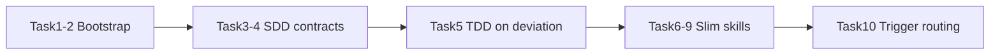

# Token Savings (Priorities 1–5) Implementation Plan

> **For agentic workers:** REQUIRED SUB-SKILL: Use wukong-code:subagent-driven-development (recommended) or wukong-code:executing-plans to implement this plan task-by-task. Steps use checkbox (`- [ ]`) syntax for tracking.

**Goal:** Cut programming-session token waste from SDD prompt paste, resident skill prose, TDD reloads, bootstrap re-injection, and over-triggering the full brainstorm→worktrees→SDD chain — without weakening Iron Laws, Red Flags tables, or the “Let’s make a react todo list” brainstorming acceptance path.

**Architecture:** Prefer mechanical wins first (bootstrap strip/dedup, SDD contract pointers). Then change load/trigger *instructions* so agents stop reloading duplicate prose. Slim high-frequency skills by moving Examples/Advantages/long rationale into `references/` while keeping checklists and hard gates resident. Behavioral trigger routing is last and narrowly scoped.

**Tech Stack:** Bash hooks, OpenCode JS plugin, Pi TypeScript extension, Markdown skills, existing Node/bash tests under `tests/`.

## Global Constraints

- Zero new third-party dependencies.
- Do not invent copyright holders; leave MIT `LICENSE` as-is.
- Do **not** weaken or delete Red Flags tables, Iron Laws, `<HARD-GATE>` for creative work, or “human partner” language.
- Acceptance invariant: user message `Let's make a react todo list` must still auto-trigger `brainstorming` before code.
- Do not open a PR to `obra/superpowers`; this is fork-local work.
- Do not commit unless the human partner explicitly asks.
- Skill slim moves are content relocation only: meaning of resident gates must stay equivalent.
- Prefer `git mv` when renaming; keep contracts under `skills/subagent-driven-development/`.

## File Structure (target)

| Path | Responsibility |
|------|----------------|
| `hooks/session-start` | Strip YAML frontmatter; optional compact skip when marker present in stdin |
| `.pi/extensions/wukong-code.ts` | Skip re-inject if `BOOTSTRAP_MARKER` appears in messages **or** compaction summary text |
| `.opencode/plugins/wukong-code.js` | Already strips FM; widen marker scan beyond first user message if needed |
| `skills/subagent-driven-development/implementer-contract.md` | Stable implementer rules (moved from full template body) |
| `skills/subagent-driven-development/task-reviewer-contract.md` | Stable reviewer rubric |
| `skills/subagent-driven-development/implementer-prompt.md` | Thin dispatch shell (placeholders + Read contract) |
| `skills/subagent-driven-development/task-reviewer-prompt.md` | Thin dispatch shell |
| `skills/subagent-driven-development/SKILL.md` | Point to contracts; TDD load-on-deviation; move Example/Advantages to references |
| `skills/*/references/*.md` | On-demand long prose for slimmed skills |
| `skills/using-wukong-code/SKILL.md` | Scope routing table (small fix vs feature) |
| `skills/brainstorming/SKILL.md` | Fast-path carve-out for named single-file mechanical fixes |
| `docs/porting-to-a-new-harness.md` | Shape A: frontmatter stripped; compact skip policy |
| `tests/hooks/test-session-start.sh` | Assert no YAML frontmatter in injected context |
| `tests/pi/test-pi-extension.mjs` | Compact skip when summary contains marker |
| `tests/opencode/test-bootstrap-caching.mjs` | Assert stripped bootstrap (no leading `---`) |



---

### Task 1: Session-start strips YAML frontmatter

**Files:**
- Modify: `hooks/session-start`
- Modify: `tests/hooks/test-session-start.sh`
- Modify: `docs/porting-to-a-new-harness.md` (Shape A frontmatter paragraph ~L359–363)

**Interfaces:**
- Consumes: `skills/using-wukong-code/SKILL.md` on disk
- Produces: injected context body **without** leading `---` / `name: using-wukong-code` frontmatter; still wrapped in `<EXTREMELY_IMPORTANT>`

- [ ] **Step 1: Write the failing frontmatter assertion**

In `tests/hooks/test-session-start.sh`, after the existing Copilot CLI assertion block and before the legacy-warning test, add:

```bash
fm_home="$(make_home frontmatter-stripped)"
assert_command_output \
    "SessionStart strips YAML frontmatter from using-wukong-code" \
    "nested" \
    "You have wukong-code" \
    "name: using-wukong-code"$'\037'"description: Use when starting" \
    "$fm_home" \
    CLAUDE_PLUGIN_ROOT="$REPO_ROOT" \
    bash "$HOOK_UNDER_TEST"
```

- [ ] **Step 2: Run test to verify it fails**

Run: `bash tests/hooks/test-session-start.sh`

Expected: FAIL on `SessionStart strips YAML frontmatter…` because current hook `cat`s the whole file including frontmatter.

- [ ] **Step 3: Implement strip in `hooks/session-start`**

Replace the content load block (currently lines 10–11) with:

```bash
# Read using-wukong-code content and strip YAML frontmatter (align with OpenCode/Pi).
using_wukong_code_raw=$(cat "${PLUGIN_ROOT}/skills/using-wukong-code/SKILL.md" 2>&1 || echo "Error reading using-wukong-code skill")
if [[ "$using_wukong_code_raw" == Error* ]]; then
  using_wukong_code_content="$using_wukong_code_raw"
else
  # Same regex contract as .opencode/plugins/wukong-code.js and .pi/extensions/wukong-code.ts
  using_wukong_code_content=$(printf '%s' "$using_wukong_code_raw" | awk '
    BEGIN { in_fm=0; done_fm=0 }
    NR==1 && /^---$/ { in_fm=1; next }
    in_fm && /^---$/ { in_fm=0; done_fm=1; next }
    in_fm { next }
    { print }
  ')
  # Trim leading blank lines after strip
  using_wukong_code_content=$(printf '%s' "$using_wukong_code_content" | sed -e '1{/./!d;}')
fi
```

Keep `escape_for_json` and JSON emission unchanged.

- [ ] **Step 4: Run test to verify it passes**

Run: `bash tests/hooks/test-session-start.sh`

Expected: `STATUS: PASSED`

- [ ] **Step 5: Update porting doc Shape A**

In `docs/porting-to-a-new-harness.md`, find the Shape A paragraph that says the script `cat`s the whole `SKILL.md` (frontmatter included). Change it to say Shape A **strips** YAML frontmatter before JSON wrap (same regex contract as Shape B), and that injected body still includes `<EXTREMELY_IMPORTANT>` / skill prose / Red Flags.

- [ ] **Step 6: Commit** (only if human asks)

```bash
git add hooks/session-start tests/hooks/test-session-start.sh docs/porting-to-a-new-harness.md
git commit -m "$(cat <<'EOF'
fix(hooks): strip using-wukong-code frontmatter on session-start

Align Shape A bootstrap with OpenCode/Pi so YAML metadata is not paid every inject.
EOF
)"
```

---

### Task 2: Compact bootstrap dedup (Pi + Claude best-effort)

**Files:**
- Modify: `.pi/extensions/wukong-code.ts`
- Modify: `tests/pi/test-pi-extension.mjs`
- Modify: `hooks/session-start` (Claude compact skip if stdin carries marker)
- Modify: `docs/porting-to-a-new-harness.md` (compaction note ~L430–433)
- Optional modify: `.opencode/plugins/wukong-code.js` (scan all messages for `EXTREMELY_IMPORTANT`)

**Interfaces:**
- Consumes: Pi `session_compact` / `context` events; Claude SessionStart stdin JSON when matcher is `compact`
- Produces: no second bootstrap when marker already present in history or compaction summary

- [ ] **Step 1: Add failing Pi test for marker-in-summary skip**

Append to `tests/pi/test-pi-extension.mjs`:

```js
test('session_compact skips inject when compaction summary still has bootstrap marker', async () => {
  const { handlers } = await loadExtension();
  const sessionCompact = firstHandler(handlers, 'session_compact');
  const context = firstHandler(handlers, 'context');

  await sessionCompact({ type: 'session_compact', compactionEntry: {}, fromExtension: false }, {});

  const summary = {
    role: 'compactionSummary',
    summary: 'Prior work. Marker present: wukong-code:using-wukong-code bootstrap for pi',
    tokensBefore: 123,
    timestamp: 1,
  };
  const user = { role: 'user', content: [{ type: 'text', text: 'Continue' }], timestamp: 2 };
  const result = await context({ type: 'context', messages: [summary, user] }, {});

  assert.equal(result, undefined, 'must not re-inject when summary retains bootstrap marker');
});
```

- [ ] **Step 2: Run Pi test — expect fail**

Run: `node --test tests/pi/test-pi-extension.mjs`

Expected: new test FAILS (current code sets `injectBootstrap=true` on compact and only checks message contents via `messageContainsBootstrap`, which does not read `summary` string on `compactionSummary` roles).

- [ ] **Step 3: Fix Pi marker detection**

In `.pi/extensions/wukong-code.ts`, replace `messageContainsBootstrap` with logic that also checks `compactionSummary.summary`:

```ts
function messageContainsBootstrap(message: unknown): boolean {
	const msg = message as { role?: unknown; summary?: unknown; content?: unknown };
	if (typeof msg.summary === "string" && msg.summary.includes(BOOTSTRAP_MARKER)) {
		return true;
	}
	const content = msg.content;
	if (typeof content === "string") return content.includes(BOOTSTRAP_MARKER);
	if (!Array.isArray(content)) return false;
	return content.some((part) => {
		return (
			part &&
			typeof part === "object" &&
			(part as { type?: unknown }).type === "text" &&
			typeof (part as { text?: unknown }).text === "string" &&
			(part as { text: string }).text.includes(BOOTSTRAP_MARKER)
		);
	});
}
```

Keep `session_compact` setting `injectBootstrap = true` — the `context` handler already returns early when `event.messages.some(messageContainsBootstrap)`.

- [ ] **Step 4: Re-run Pi tests**

Run: `node --test tests/pi/test-pi-extension.mjs`

Expected: all PASS, including the new skip test and the existing “inject when summary is plain text” test.

- [ ] **Step 5: Claude compact skip (best-effort)**

At top of `hooks/session-start`, after `PLUGIN_ROOT` is set, add:

```bash
# On Claude compact, skip re-inject if stdin JSON still carries our marker
# (field names vary by harness version — check common locations).
if [ -n "${CLAUDE_PLUGIN_ROOT:-}" ] && [ -z "${CURSOR_PLUGIN_ROOT:-}" ] && [ -z "${COPILOT_CLI:-}" ]; then
  if [ ! -t 0 ]; then
    stdin_json=$(cat || true)
    if printf '%s' "$stdin_json" | grep -q '"source"[[:space:]]*:[[:space:]]*"compact"\|"matcher"[[:space:]]*:[[:space:]]*"compact"\|compact'; then
      if printf '%s' "$stdin_json" | grep -q 'EXTREMELY_IMPORTANT\|You have wukong-code'; then
        # Marker still present in compact payload/summary — do not pay bootstrap again
        printf '{}\n'
        exit 0
      fi
    fi
    # Re-open stdin for any future readers: we already consumed it; continue with inject.
    # (Claude SessionStart does not need the body for inject content.)
  fi
fi
```

**Important:** If reading stdin breaks Claude SessionStart on `startup` (some harnesses require empty stdin), gate more narrowly: only attempt `cat` when `COMPACT=1` is unset and document the finding. Verify by running `bash tests/hooks/test-session-start.sh` — if shapes break, **revert the stdin consume** and instead document in `docs/porting-to-a-new-harness.md`: “Claude Code compact re-inject cannot safely skip without a documented summary field; Pi/OpenCode handle dedup.”

Update the compaction paragraph in `docs/porting-to-a-new-harness.md` to describe: Pi skips when `BOOTSTRAP_MARKER` survives in compaction summary; Claude best-effort skip when compact stdin still contains marker; otherwise re-inject.

- [ ] **Step 6: Optional OpenCode widen**

In `.opencode/plugins/wukong-code.js`, if dedup currently only checks the first user message, change the presence check to scan **all** message parts for `EXTREMELY_IMPORTANT` (same marker string already used). Add/adjust assertion in `tests/opencode/test-bootstrap-caching.mjs` that cached bootstrap body does not start with `---`.

- [ ] **Step 7: Run hook + Pi + OpenCode smoke tests**

```bash
bash tests/hooks/test-session-start.sh
node --test tests/pi/test-pi-extension.mjs
# if present:
bash tests/opencode/test-bootstrap-caching.sh 2>/dev/null || node --test tests/opencode/test-bootstrap-caching.mjs
```

Expected: PASS (or document Claude skip as unsupported).

---

### Task 3: Extract SDD implementer + reviewer contracts

**Files:**
- Create: `skills/subagent-driven-development/implementer-contract.md`
- Create: `skills/subagent-driven-development/task-reviewer-contract.md`
- Modify: `skills/subagent-driven-development/implementer-prompt.md`
- Modify: `skills/subagent-driven-development/task-reviewer-prompt.md`
- Modify: `skills/subagent-driven-development/SKILL.md` (Prompt Templates + File Handoffs sections)

**Interfaces:**
- Consumes: existing full template bodies
- Produces: thin dispatch templates (≤ ~40 lines of prompt body) that instruct subagents to `Read` the contract file at a stable path relative to the skill directory

- [ ] **Step 1: Create `implementer-contract.md`**

Move the stable rules currently inside the fenced prompt of `implementer-prompt.md` (Before You Begin, Your Job list, Code Organization, When You're in Over Your Head, Self-Review, After Review Findings, Report Format) into:

`skills/subagent-driven-development/implementer-contract.md`

Start the file with:

```markdown
# Implementer Contract

Read this entire file before implementing. Follow it for every SDD task.
Controller fills only the dispatch shell (brief path, report path, scene-setting).
```

Paste the moved sections **verbatim** (do not soften gates). Update TDD lines as follows while moving:

- Your Job item 2 becomes: `Follow the TDD steps written in the task brief/plan (RED → GREEN → commit). Do **not** load the full wukong-code:test-driven-development skill unless the brief omits TDD steps, you skipped RED, or a reviewer required TDD remediation.`
- Testing self-review / TDD Evidence sections stay; keep requiring RED/GREEN evidence in the report when TDD applies.

- [ ] **Step 2: Create `task-reviewer-contract.md`**

Move the stable rubric from the fenced body of `task-reviewer-prompt.md` (purpose, what to verify, verdict format, never-do list) into:

`skills/subagent-driven-development/task-reviewer-contract.md`

Header:

```markdown
# Task Reviewer Contract

Read this entire file before reviewing. Apply both verdicts (spec + quality).
```

Keep rubric wording equivalent — do not drop checklist items.

- [ ] **Step 3: Shrink `implementer-prompt.md` to a thin shell**

Replace file contents with:

```markdown
# Implementer Subagent Prompt Template

Use this template when dispatching an implementer subagent.
Stable rules live in [implementer-contract.md](implementer-contract.md) —
do **not** paste that file into the dispatch. Tell the subagent to Read it.

```
Subagent (general-purpose):
  description: "Implement Task N: [task name]"
  model: [MODEL — REQUIRED: choose per SKILL.md Model Selection; an omitted
         model silently inherits the session's most expensive one]
  prompt: |
    You are implementing Task N: [task name]

    ## Contract (read first)

    Read and follow:
    skills/subagent-driven-development/implementer-contract.md

    ## Task Description

    Read your task brief first: [BRIEF_FILE]
    It contains the full task text from the plan (exact values verbatim).

    ## Context

    [Scene-setting: where this fits, dependencies, architectural context]

    ## Paths

    - Work from: [directory]
    - Write full report to: [REPORT_FILE]

    ## Before You Begin

    Ask clarifying questions now if requirements, approach, or assumptions are unclear.

    Then implement per the contract. Return only the short status block
    (detail lives in the report file).
```
```

- [ ] **Step 4: Shrink `task-reviewer-prompt.md` to a thin shell**

Same pattern: point at `task-reviewer-contract.md`, keep placeholders `[BRIEF_FILE]`, `[REPORT_FILE]`, `[DIFF_FILE]`, `[BASE_SHA]`, `[HEAD_SHA]`, `[GLOBAL_CONSTRAINTS]`, `[MODEL]`.

- [ ] **Step 5: Update SDD `SKILL.md` Prompt Templates + File Handoffs**

Under `## Prompt Templates`, list contracts + thin templates:

```markdown
## Prompt Templates

- [implementer-contract.md](implementer-contract.md) — stable implementer rules (subagent Reads once)
- [implementer-prompt.md](implementer-prompt.md) — thin dispatch shell (placeholders only)
- [task-reviewer-contract.md](task-reviewer-contract.md) — stable reviewer rubric
- [task-reviewer-prompt.md](task-reviewer-prompt.md) — thin dispatch shell
- Final whole-branch review: use wukong-code:requesting-code-review's [code-reviewer.md](../requesting-code-review/code-reviewer.md)
```

In `## File Handoffs`, add after the brief/report bullets:

```markdown
- **Contracts:** do not paste `implementer-contract.md` / `task-reviewer-contract.md`
  into the dispatch prompt. Instruct the subagent to Read the path under
  `skills/subagent-driven-development/`. Controllers must not `Read` the
  full contract into their own context on every task — only fill the thin
  template placeholders.
```

- [ ] **Step 6: Verify file presence + template size**

```bash
test -f skills/subagent-driven-development/implementer-contract.md
test -f skills/subagent-driven-development/task-reviewer-contract.md
# thin templates should be much smaller than contracts
wc -l skills/subagent-driven-development/implementer-prompt.md \
      skills/subagent-driven-development/implementer-contract.md \
      skills/subagent-driven-development/task-reviewer-prompt.md \
      skills/subagent-driven-development/task-reviewer-contract.md
```

Expected: each `*-prompt.md` line count **less than** its matching `*-contract.md`; prompts roughly ≤ 50 lines; contracts contain Report Format / rubric keywords (`DONE_WITH_CONCERNS`, spec compliance, etc.).

```bash
rg -n "DONE_WITH_CONCERNS|TDD Evidence|spec compliance" skills/subagent-driven-development/
```

Expected: hits in contract files (and SKILL if mentioned), not missing entirely.

---

### Task 4: SDD controller skill — move Example/Advantages to references

**Files:**
- Create: `skills/subagent-driven-development/references/example-workflow.md`
- Create: `skills/subagent-driven-development/references/advantages.md`
- Modify: `skills/subagent-driven-development/SKILL.md`

**Interfaces:**
- Consumes: current `## Example Workflow` and `## Advantages` sections in SKILL.md
- Produces: shorter resident SKILL with links; process digraph, File Handoffs, Red Flags, Integration remain resident

- [ ] **Step 1: Move sections with git-friendly cut/paste**

```bash
mkdir -p skills/subagent-driven-development/references
```

Cut `## Example Workflow` (through end of example, before `## Advantages`) into `references/example-workflow.md` with title `# Example Workflow`.

Cut `## Advantages` (through end, before `## Red Flags`) into `references/advantages.md` with title `# Advantages`.

- [ ] **Step 2: Leave pointers in SKILL.md**

Where the sections were, insert:

```markdown
## Example Workflow

On-demand narrative (do not load unless teaching/debugging SDD itself):
`skills/subagent-driven-development/references/example-workflow.md`

## Advantages

On-demand comparison vs manual/executing-plans:
`skills/subagent-driven-development/references/advantages.md`
```

- [ ] **Step 3: Sanity check resident gates still present**

```bash
rg -n "File Handoffs|Red Flags|Prompt Templates|implementer-contract|HARD-GATE|progress.md" skills/subagent-driven-development/SKILL.md
wc -l skills/subagent-driven-development/SKILL.md
```

Expected: File Handoffs + Red Flags still in SKILL.md; line count clearly below previous 418 (target roughly ≤ 320).

---

### Task 5: TDD load-on-deviation (Priority 3)

**Files:**
- Modify: `skills/subagent-driven-development/SKILL.md` (`## Integration`)
- Modify: `skills/subagent-driven-development/implementer-contract.md` (already updated in Task 3 — verify)
- Modify: `skills/writing-plans/SKILL.md` (one line under Execution Handoff / Remember)

**Interfaces:**
- Consumes: plans that already embed RED→GREEN steps (writing-plans task template)
- Produces: SDD no longer tells every subagent to load full TDD skill by default

- [ ] **Step 1: Replace Integration “Subagents should use” block**

In `skills/subagent-driven-development/SKILL.md`, change:

```markdown
**Subagents should use:**
- **wukong-code:test-driven-development** - Subagents follow TDD for each task
```

to:

```markdown
**TDD for subagents:**
- Default: follow the TDD steps already written in the task brief/plan and
  record RED/GREEN evidence in the report (see implementer-contract.md).
- Load **wukong-code:test-driven-development** only when: the brief omits TDD
  steps, the implementer skipped RED, or a reviewer requires TDD remediation.
```

- [ ] **Step 2: Add one sentence to writing-plans**

In `skills/writing-plans/SKILL.md` under `## Remember` (or Execution Handoff), add:

```markdown
- Plans are the TDD source of truth for SDD implementers: keep per-task
  RED→GREEN steps explicit so implementers need not reload the full TDD skill.
```

- [ ] **Step 3: Verify no contradictory “always load TDD” in SDD resident skill**

```bash
rg -n "test-driven-development" skills/subagent-driven-development/
```

Expected: Integration block matches load-on-deviation; contract matches; marketing text in `references/advantages.md` may still say “follow TDD naturally” (OK — on-demand).

---

### Task 6: Slim test-driven-development + systematic-debugging

**Files:**
- Create: `skills/test-driven-development/references/rationalizations-and-examples.md`
- Create: `skills/systematic-debugging/references/rationalizations-and-depth.md`
- Modify: `skills/test-driven-development/SKILL.md`
- Modify: `skills/systematic-debugging/SKILL.md`

**Interfaces:**
- Produces: resident Iron Law + R-G-R / Four Phases + Verification/Quick Reference checklists; long rationalization tables and worked examples on demand

- [ ] **Step 1: TDD — move long sections**

From `skills/test-driven-development/SKILL.md`, move to `references/rationalizations-and-examples.md` (keep headings):

- “Why the order matters” / deep rationale essays (if present as long prose)
- “Common Rationalizations” table/list
- Long “Example” / “Bug Fix” walkthroughs
- “When Stuck” extended narrative

Keep resident:

- Frontmatter
- Iron Law / when TDD applies
- Red-Green-Refactor procedure
- Verification checklist
- Link line: `For rationalizations and worked examples, Read skills/test-driven-development/references/rationalizations-and-examples.md` and existing `testing-anti-patterns.md` pointer

- [ ] **Step 2: systematic-debugging — same pattern**

Move Common Rationalizations + Real-World Impact + any multi-page Phase essays that duplicate the Quick Reference into `references/rationalizations-and-depth.md`.

Keep resident: Iron Law, Four Phases checklist, Quick Reference, links to existing technique files under the skill directory.

- [ ] **Step 3: Size check**

```bash
wc -l skills/test-driven-development/SKILL.md skills/systematic-debugging/SKILL.md
rg -n "Iron Law|Red-Green|Four Phases|Quick Reference" skills/test-driven-development/SKILL.md skills/systematic-debugging/SKILL.md
```

Expected: each SKILL.md substantially shorter than 371 / 296; Iron Law + checklists still present.

---

### Task 7: Slim brainstorming + using-git-worktrees

**Files:**
- Create: `skills/brainstorming/references/process-depth.md`
- Create: `skills/using-git-worktrees/references/worktree-setup.md`
- Modify: `skills/brainstorming/SKILL.md`
- Modify: `skills/using-git-worktrees/SKILL.md`

- [ ] **Step 1: brainstorming**

Move duplicate Key Principles expansions and long Process Flow prose that restates the Checklist into `references/process-depth.md`.

**Keep resident unchanged in meaning:**

- `<HARD-GATE>` (Task 10 will add a narrow carve-out — do not remove the gate here)
- Checklist items 1–9
- Visual Companion section + pointer to `visual-companion.md`
- Spec self-review + user review gate
- Terminal → writing-plans

Add pointer:

```markdown
## Process depth (on demand)

`skills/brainstorming/references/process-depth.md`
```

- [ ] **Step 2: using-git-worktrees**

Move lengthy directory-selection / safety verification narratives into `references/worktree-setup.md`. Keep Step 0 detect + 1a/1b decision + Red Flags resident.

- [ ] **Step 3: Verify**

```bash
rg -n "HARD-GATE|Checklist|visual-companion" skills/brainstorming/SKILL.md
rg -n "Step 0|Red Flags" skills/using-git-worktrees/SKILL.md
```

---

### Task 8: Slim finishing-a-development-branch (+ light writing-plans)

**Files:**
- Create: `skills/finishing-a-development-branch/references/finish-options.md`
- Modify: `skills/finishing-a-development-branch/SKILL.md`
- Modify: `skills/writing-plans/SKILL.md` (optional: move Self-Review detail only if still long after Task 5)

- [ ] **Step 1: finishing**

Move per-option long procedures (merge vs PR vs discard details) into `references/finish-options.md`. Keep: Verify tests → Detect base branch → Present options → execute choice.

- [ ] **Step 2: writing-plans**

Do **not** move the Task Structure fenced example (load-bearing for plan quality). Only move Self-Review essay text if it duplicates the checklist already present; keep header template and bite-sized granularity rules resident.

- [ ] **Step 3: Verify**

```bash
rg -n "Verify|Present options|Task Structure|No Placeholders" \
  skills/finishing-a-development-branch/SKILL.md \
  skills/writing-plans/SKILL.md
```

---

### Task 9: Do not slim using-wukong-code Red Flags

**Files:** none for deletion; optional one-line comment in plan completion notes only.

- [ ] **Step 1: Explicit non-change check**

```bash
wc -l skills/using-wukong-code/SKILL.md
rg -n "Red Flags|1% chance" skills/using-wukong-code/SKILL.md
```

Expected: Red Flags table intact. Task 10 may **add** a Scope routing section; it must not remove Red Flags rows. “The skill is overkill” row stays — Scope routing clarifies *which* skill, not whether to skip skills entirely.

---

### Task 10: Trigger strategy — small-fix fast path (Priority 5)

**Files:**
- Modify: `skills/using-wukong-code/SKILL.md`
- Modify: `skills/brainstorming/SKILL.md`
- Modify: `skills/subagent-driven-development/SKILL.md` (When to Use — optional one bullet)
- Modify: `docs/porting-to-a-new-harness.md` acceptance note if it implies every message brainstorms (only if such wording exists)

**Interfaces:**
- Produces: clear routing so mechanical single-file fixes skip brainstorm→worktrees→SDD; creative/ambiguous work still hard-gated

- [ ] **Step 1: Add Scope routing to using-wukong-code**

After `## Skill Priority`, insert:

```markdown
## Scope routing

Pick the smallest process skill that fits. Do **not** auto-chain
brainstorming → writing-plans → using-git-worktrees → subagent-driven-development
for mechanical work.

| User intent | Route |
|-------------|--------|
| New feature, behavior change, or ambiguous product intent ("let's build X", "add Y") | `brainstorming` first (then plans / SDD as that skill directs) |
| Bug with unclear root cause | `systematic-debugging` first |
| Named mechanical fix (exact file + exact change: typo, lint, one-liner, "just change Z in foo.ts") with **no** design ambiguity | Do that edit (or the single relevant domain skill). Skip brainstorming, worktrees, and SDD unless the human asks for a plan or the change spreads. |
| Multi-step implementation with a written plan | `executing-plans` or `subagent-driven-development` as appropriate; use worktrees when those skills require isolation |

**Still mandatory:** if any skill applies, invoke it before acting. Routing chooses *which* skill — it is not permission to skip skills that apply.
```

- [ ] **Step 2: Carve brainstorming HARD-GATE / anti-pattern**

Replace the absolute “EVERY project” / “config change — all of them” anti-pattern with a scoped version that **keeps** the creative gate:

In `skills/brainstorming/SKILL.md`:

1. Update frontmatter `description` to mention creative/behavior-changing work (keep MUST for features/components/functionality).

2. Change `<HARD-GATE>` to:

```markdown
<HARD-GATE>
Do NOT invoke any implementation skill, write any code, scaffold any project, or take any implementation action until you have presented a design and the user has approved it — whenever this skill applies (new features, behavior changes, or ambiguous product intent).
</HARD-GATE>
```

3. Replace `## Anti-Pattern: "This Is Too Simple To Need A Design"` with:

```markdown
## Anti-Pattern: "This Is Too Simple To Need A Design"

If you are about to build a feature, change user-facing behavior, or invent a design, you do **not** get to skip this skill because it "feels small." A todo list, a new utility module, or a behavior tweak still needs a short design and approval.

**Fast path (does not use this skill):** the human named an exact mechanical edit with no design choices (typo, rename already agreed, clear one-line fix in a specified file). That path is routed in `using-wukong-code` Scope routing — do not force brainstorming onto it.
```

- [ ] **Step 3: Optional SDD When-to-Use bullet**

If SDD has a “When to Use” section, add:

```markdown
- Skip SDD for single mechanical tasks already in-session with no multi-task plan — prefer direct execution or executing-plans for a tiny plan.
```

- [ ] **Step 4: Acceptance invariant check (manual)**

Confirm docs / bootstrap still imply: for `Let's make a react todo list`, agent must invoke brainstorming (Scope routing table row 1).

```bash
rg -n "Let's build X|brainstorming first|Scope routing|Fast path" skills/using-wukong-code/SKILL.md skills/brainstorming/SKILL.md
```

Expected: feature path → brainstorming; fast path documented; Red Flags intact.

- [ ] **Step 5: Run mechanical test suite**

```bash
bash tests/hooks/test-session-start.sh
node --test tests/pi/test-pi-extension.mjs
rg -i 'superpowers' . || true   # should remain empty product-name hits
```

If `evals/` is cloned, note that Priority 5/2/3 deserve adversarial sessions (todo-list still brainstorms; “fix typo in README” skips full chain; implementer still records RED/GREEN). Record results for the human partner — do not claim eval pass without running them.

---

## Self-Review (plan author)

**1. Spec coverage (priorities 1–5):**
- P1 → Tasks 3–4
- P2 → Tasks 4, 6–9
- P3 → Task 5 (+ contract text in Task 3)
- P4 → Tasks 1–2
- P5 → Task 10

**2. Placeholder scan:** No TBD/TODO steps; commands and file paths are concrete. Claude compact skip has an explicit fallback if stdin consume breaks hooks.

**3. Type/path consistency:** Contract filenames `implementer-contract.md` / `task-reviewer-contract.md` used uniformly; bootstrap marker strings match existing Pi/OpenCode constants.

**4. Residual risk:** Tasks 5 and 10 are behavioral. Keep Red Flags / Iron Laws; validate with real sessions or `evals/` before treating as proven.

---

## Execution Handoff

Plan complete and saved to `docs/wukong-code/plans/2026-07-19-token-savings.md`.

**Two execution options:**

1. **Subagent-Driven (recommended)** — fresh subagent per task, review between tasks  
2. **Inline Execution** — this session with `executing-plans`, batch with checkpoints  

Which approach?
